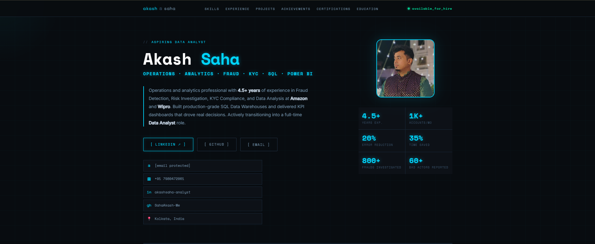

# Akash Saha — Personal Profile Page

> 🌐 **Live Site:** [sahaakash-me.github.io/Akash_Saha.github.io](https://sahaakash-me.github.io/Akash_Saha.github.io)

---

## Preview

---

## About

Personal profile page for **Akash Saha** — Aspiring Data Analyst with 4.5+ years of experience in Fraud Detection, Risk Investigation, KYC Compliance, and Data Analysis at Amazon and Wipro.

---

## Tech Stack

- Pure HTML5 + CSS3 + Vanilla JavaScript
- No frameworks, no dependencies
- Self-contained single file (`index.html`)
- Google Fonts — Space Mono + Inter

---

## Features

- 🌑 Dark & Techy — Cyan Terminal theme
- 📱 Responsive design
- 🔐 Password-protected Edit Panel
- ✨ Animated cursor glow effect
- 🔗 Smooth scroll navigation
- 📧 Email modal with Gmail / Outlook / Yahoo support

---

## Contact

- 📧 sahaakash6@gmail.com
- 💼 [LinkedIn](https://www.linkedin.com/in/akashsaha-analyst/)
- 🐙 [GitHub](https://github.com/SahaAkash-Me)
- 📍 Kolkata, India
